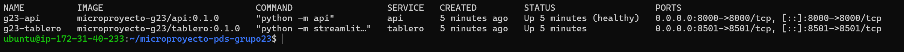
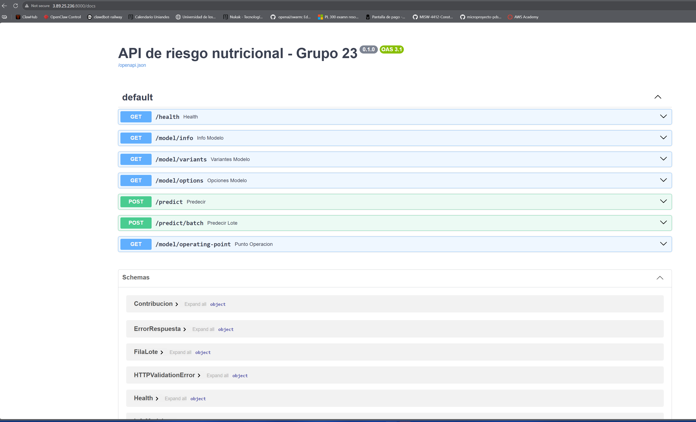
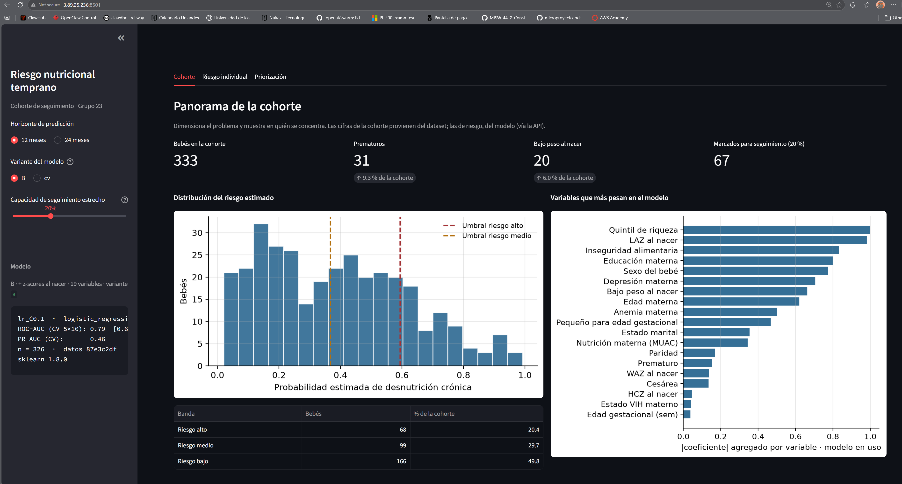
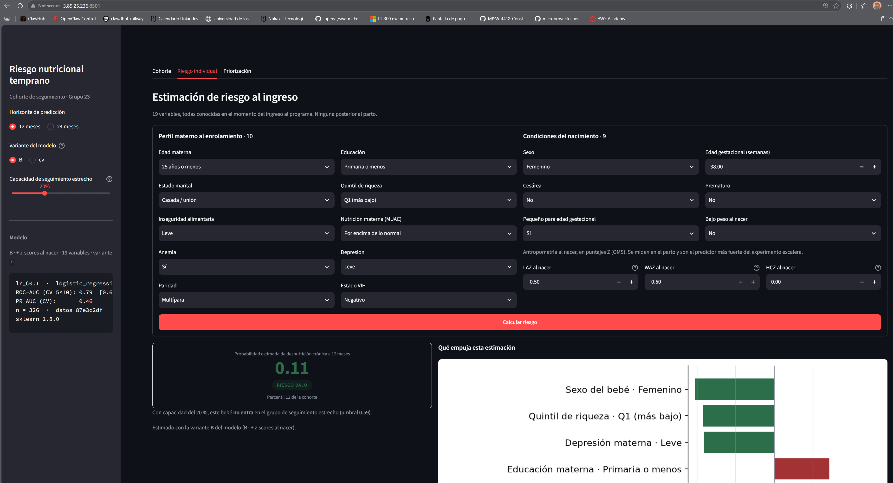
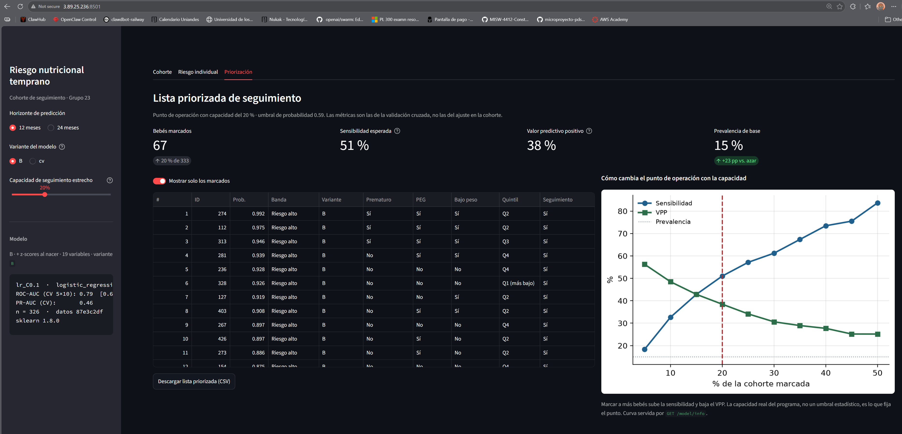

# Predicción temprana de desnutrición crónica infantil

**A partir del perfil materno al enrolamiento y los datos del nacimiento**

Micro-proyecto · **Entrega 3** · Septiembre de 2026  
Proyecto: Desarrollo de Soluciones — Maestría en Inteligencia Artificial, Universidad de los Andes  
**Grupo 23**, en colaboración con la **Fundación Canguro**

## Equipo

| Integrante | GitHub |
|---|---|
| César Andrés Romero Cruzate | [@Caromeroc12](https://github.com/Caromeroc12) |
| Alejandro Mesa Bustamante | [@mesabusta](https://github.com/mesabusta) |
| Juan Felipe Rodríguez Granados | [@felipe97rg](https://github.com/felipe97rg) |
| Yeisson Steven Useche Ocampo | [@ysusecheo93](https://github.com/ysusecheo93) |
| Fabio Romero Manrique | [@fromerom1](https://github.com/fromerom1) |

El aporte de cada integrante queda registrado en los commits y los *pull requests* del
repositorio.

## El prototipo

| Entrega | Qué es | Dónde |
|---|---|---|
| 1 · Maqueta | SPA estática con las tres vistas del prototipo | https://fromerom1.github.io/microproyecto-pds-grupo23/Mockup/ |
| 2 · Tablero | Streamlit sobre el modelo real | `docker compose up -d` → `:8501` |
| 3 · Prototipo desplegado | Modelo empaquetado, API, tablero, ambos en Docker sobre EC2 | `:8501` (tablero) y `:8000/docs` (API) de la instancia |

> El despliegue corre en una instancia de AWS Academy Learner Lab, sin dirección
> elástica: **la IP pública cambia cada vez que la máquina se detiene y se vuelve a
> encender.** Consúltela en la consola de EC2 antes de usarla.

---

## El problema

La desnutrición crónica infantil es predominantemente **adquirida**: el 82 % de los
niños que la presentan a los 24 meses nacieron sin ella. Eso abre una ventana de
intervención durante el primer año de vida. El problema es que cuando el retraso en
la talla ya es visible en la curva de crecimiento, lleva meses desarrollándose y es
difícil de revertir, y los recursos de seguimiento son limitados.

### Pregunta de negocio

> ¿Es posible predecir, a partir del perfil materno al enrolamiento y los datos del
> nacimiento, si un bebé desarrollará desnutrición crónica (stunting) durante sus
> primeros 24 meses de vida, para priorizar intervenciones nutricionales y de
> cuidado canguro?

### Producto

Un prototipo funcional compuesto por modelos supervisados empaquetados, una API que
sirve las inferencias y un tablero que consume el modelo **a través de esa API**,
desplegado en contenedores Docker.

---

## Datos

Cohorte observacional publicada en PLOS Medicine: *Differences in growth trajectories
in breastfed HIV-exposed uninfected and HIV-unexposed infants in Kenya*
(Zenodo, record 15867528).

| | |
|---|---|
| Bebés | 333 |
| Visitas | 2.934 en 9 momentos: nacimiento, semanas 3 y 6, meses 3, 6, 9, 12, 18 y 24 |
| Variables | 39 |
| Target | `stunted` = LAZ < −2 |
| Prevalencia | 15,0 % a 12 meses · 29,4 % a 24 meses |

Se eligió como **proxy** del problema de la Fundación Canguro porque es longitudinal,
contiene las condiciones neonatales de interés del Método Madre Canguro (prematuro,
bajo peso al nacer, pequeño para edad gestacional) y registra determinantes sociales
y nutricionales modificables.

**Limitación de transferencia:** en esta cohorte solo el 9,3 % de los niños es
prematuro y el 6,0 % tiene bajo peso al nacer. En un Programa Madre Canguro esa
proporción es del 100 % por definición del programa.

### Obtener los datos

El CSV no está en Git: se versiona con DVC contra un bucket S3.

```bash
pip install "dvc[s3]"
dvc pull
```

Requiere credenciales de AWS con acceso al remoto declarado en `.dvc/config`. Si el
remoto no está disponible, el dataset crudo es público: puede descargarse de Zenodo y
colocarse en `data/plosmed_data_newid.csv`, y `python -m src.features` reconstruye el
procesado. El manual de instalación documenta las tres rutas.

**Archivos versionados en S3**

```
data/plosmed_data_newid.csv                 crudo, 659 KB
data/processed/model_dataset.csv            baseline 16 features, 43 KB
data/processed/model_dataset_escalera.csv   4 peldaños A/B/C/D, 68 KB
```

---

## Arquitectura del prototipo

```
   navegador ──► tablero :8501 ──HTTP──► api :8000 ──► modelo empaquetado
                 (Streamlit)             (FastAPI)     (modelo-stunting)
                      │                      │
                      └──── volumen ─────────┘
                        data/processed/  (solo lectura)
```

Dos contenedores en la red interna de Docker Compose. El tablero **no importa el
modelo**: le pregunta a la API por el nombre del servicio (`http://api:8000`). El
modelo viaja dentro de las dos imágenes como la distribución `modelo-stunting`,
construida desde `src/` en la primera etapa de cada Dockerfile.

La cohorte de referencia **no viaja en las imágenes**: se monta como volumen de solo
lectura. La decisión es deliberada — los datos del Observatorio Canguro llegarán bajo
acuerdo de confidencialidad y no deben quedar dentro de un artefacto que se publica.

El arranque lo encadena un *healthcheck* sobre `GET /health`: el tablero no se levanta
hasta que la API reporta que modelo y cohorte están disponibles, de modo que un
problema de datos se manifiesta como un servicio que no arranca y no como un tablero
con errores en pantalla.

### Levantar el prototipo

```bash
dvc pull                      # o reconstruir el CSV, ver arriba
docker compose up -d --build
docker compose ps             # api debe quedar en estado healthy
```

- Tablero: <http://localhost:8501>
- API: <http://localhost:8000/docs>



Procedimiento completo, requisitos, despliegue en EC2 y solución de problemas:
[`docs/MANUAL_INSTALACION.md`](docs/MANUAL_INSTALACION.md).
Cómo usar el tablero: [`docs/MANUAL_USUARIO.md`](docs/MANUAL_USUARIO.md).

---

## Estructura del repositorio

```
.dvc/                       configuración de DVC (remoto S3)
dvc.yaml                    pipeline DVC: features → evaluate → escalera
dvc.lock                    grafo ejecutado y verificado
data/                       datasets versionados con DVC (punteros .dvc)

src/preprocessing.py        contrato de modelado y preprocesamiento — fuente única de verdad
src/train_stunting.py       entrenamiento con un split y registro en MLflow
src/evaluate_cv.py          evaluación robusta: CV estratificada repetida, IC, punto de operación
src/features.py             dataset del experimento escalera desde el CSV crudo (z-scores tempranos)
src/experimento_escalera.py cuánto mejora la predicción con cada visita de seguimiento
src/robustez.py             CV anidada, baselines clínicos, calibración y umbrales
src/checks_calidad.py       duplicados, consistencia y asociación entre predictores
src/predict.py              módulo de predicción: el contrato que consumen el tablero y la API

api/                        servicio FastAPI sobre src.predict — ver api/README.md
api/tests/                  55 pruebas del contrato, del descubrimiento de modelos y de errores
app/dashboard.py            tablero Streamlit (tres vistas), consume la API por HTTP

pyproject.toml              distribución modelo-stunting: empaqueta src/ como wheel
deploy/Dockerfile.api       imagen de la API (multietapa: wheel + servicio)
deploy/Dockerfile.tablero   imagen del tablero (multietapa: wheel + Streamlit)
deploy/requirements-*.txt   dependencias de cada imagen, con las del pickle fijadas
docker-compose.yml          los dos servicios, healthcheck y volumen de la cohorte
.dockerignore               recorta el contexto de build

models/                     modelos entrenados (.joblib) y sus metadatos (.json)
figures/                    EDA (01_EDA), baseline (02_model), barrido MLflow (03_mlflow),
                            CV (03_cv), escalera (04_escalera), robustez (04_robustez)
notebooks/                  01_EDA.ipynb y 02_modelado.ipynb
Mockup/                     maqueta del prototipo (SPA) — ver Mockup/README.md
docs/MANUAL_INSTALACION.md  instalación local y despliegue en EC2
docs/MANUAL_USUARIO.md      manual de usuario del tablero
docs/MLFLOW_EC2.md          guía del servidor de MLflow en EC2
docs/soportes/              evidencias por entrega
requirements.txt            dependencias de desarrollo, con las del artefacto fijadas
CHANGELOG.md                registro de cambios del proyecto
```

---

## Reproducir el análisis

```bash
pip install -r requirements.txt
dvc pull
cd notebooks && jupyter notebook 01_EDA.ipynb
```

El notebook usa rutas relativas a su propia carpeta. Las figuras que genera quedan en
`notebooks/figures/`; las versionadas para el reporte están en `figures/01_EDA/`.

## Entrenar y evaluar

Todo se ejecuta **desde la raíz del repositorio** con `python -m`, para que `src/` sea
importable. Es lo que garantiza que el modelo serializado pueda abrirse después desde
el tablero, la API o un contenedor.

### Pipeline DVC (recomendado)

```bash
dvc repro
```

Ejecuta las tres etapas en orden:

1. `features` — construye `model_dataset_escalera.csv` desde el CSV crudo
2. `evaluate` — CV estratificada 5×10 para ambos horizontes (12 m y 24 m)
3. `escalera` — 4 peldaños × 2 horizontes × 2 familias, CV 5×10

`dvc.lock` verifica que el pipeline se ejecutó con las versiones fijadas en
`requirements.txt` (pandas 2.3.3, scikit-learn 1.8.0, mlflow 2.22.5).

### Etapa por etapa

```bash
python -m src.evaluate_cv --target 24m      # CV 5x10, 7 configuraciones — ~4 min
python -m src.evaluate_cv --target 12m
python -m src.features                      # construye el dataset de la escalera
python -m src.experimento_escalera          # 4 peldaños x 2 horizontes x 2 familias — ~6 min
python -m src.robustez                      # CV anidada, baselines, calibración — peldaño B
python -m src.train_stunting --model lr --C 0.1
python -m src.predict --demo                # prueba rápida del módulo de predicción
```

`evaluate_cv` deja en `models/model_stunting_<horizonte>_cv.joblib` el modelo de 16
variables basales; `experimento_escalera` deja en `models/model_stunting_<horizonte>_B.joblib`
el del peldaño B (16 basales + z-scores al nacer). En ambos casos el `.json` contiguo
guarda umbrales de banda, curva sensibilidad-vs-capacidad y métricas de CV. **La API
sirve B por defecto**, porque es el mejor modelo con información disponible al ingreso.

### El experimento escalera

Cuatro bloques acumulativos de variables, cada uno un momento clínico real, evaluados con
la misma CV 5×10. Responde a *¿en qué momento la predicción se vuelve confiable?*

| Peldaño | Variables | ROC-AUC 24 m | ROC-AUC 12 m | Estado |
|---|---|---|---|---|
| A · basales (ingreso) | 16 | 0.58 [0.48, 0.72] | 0.68 [0.57, 0.81] | empaquetado como variante `cv` |
| B · + z-scores al nacer | 19 | **0.72** [0.61, 0.84] | **0.79** [0.67, 0.88] | empaquetado, servido por defecto |
| C · + semana 3 | 23 | 0.75 [0.63, 0.87] | 0.81 [0.67, 0.90] | evaluado |
| D · + mes 3 | 27 | 0.79 [0.68, 0.89] | 0.85 [0.73, 0.94] | evaluado |

El salto grande está en **B**: la antropometría al nacer, que se mide en el parto y ya se
conoce al ingreso. El contrato original de 16 variables la omitía. El random forest
reproduce la misma escalera, así que el patrón no depende de la familia de modelo.

### Por qué validación cruzada y no un solo split

Con 333 bebés, un split 70/15/15 deja ~49 en test. Medido con 20 semillas distintas, el
ROC-AUC de test del mismo modelo oscila entre **0.43 y 0.81**: ese número describe a la
semilla, no al modelo. La CV estratificada repetida (50 evaluaciones) da una media con
intervalo de confianza, y la regla de un error estándar elige, entre las configuraciones
estadísticamente indistinguibles, la más simple.

### MLflow

Sin configuración, los scripts registran en `./mlruns` (local). Para registrar en el
servidor del equipo en EC2:

```bash
export MLFLOW_TRACKING_URI=http://<ip>:8050      # PowerShell: $env:MLFLOW_TRACKING_URI = "..."
```

La guía completa está en [`docs/MLFLOW_EC2.md`](docs/MLFLOW_EC2.md).

---

## La API

Servicio FastAPI sobre `src.predict.ModeloRiesgo`, sin duplicar el preprocesamiento del
entrenamiento. Descubre los modelos disponibles leyendo los pares `.json`/`.joblib` de
`models/`, de modo que empaquetar una variante nueva basta para servirla.

| Ruta | Devuelve |
|---|---|
| `GET /health` | Disponibilidad de modelos y cohorte; 503 con la causa |
| `GET /model/info` | Metadatos, variables y curva de capacidad |
| `GET /model/variants` | Horizontes y variantes disponibles |
| `GET /model/options` | Categorías válidas de cada variable |
| `POST /predict` | Probabilidad, banda, percentil y contribuciones |
| `POST /predict/batch` | Ranking de hasta 5.000 registros, con marca de seguimiento |
| `GET /model/operating-point` | Sensibilidad, VPP y umbral para una capacidad dada |



La documentación la genera FastAPI a partir de los esquemas Pydantic, de modo que no se
desactualiza respecto al código. Contrato completo, ejemplos de petición y respuesta,
variables de entorno y cómo correr las pruebas: [`api/README.md`](api/README.md).

```bash
python -m api                                    # levanta el servicio en :8000
python -m pytest -q                              # 55 pruebas
docker compose run --rm --entrypoint python api -m pytest -q   # las mismas, en el contenedor
```

## El tablero

Streamlit con las tres vistas de la maqueta, consumiendo la API por HTTP. Tres controles
en la barra lateral gobiernan todo lo que se ve: horizonte (12 o 24 meses), variante del
modelo y capacidad de seguimiento como porcentaje de la cohorte.

```bash
python -m streamlit run app/dashboard.py         # requiere la API corriendo aparte
```

La URL de la API se configura con `DASHBOARD_API_URL` (por defecto
`http://localhost:8000`; en el compose, `http://api:8000`).

### Cohorte — dimensionar el problema



Los cuatro indicadores separan lo que viene del dataset —333 bebés, 31 prematuros, 20 con
bajo peso al nacer— de lo que viene del modelo: 67 marcados con capacidad del 20 %.

El histograma muestra la distribución del riesgo con los dos umbrales de banda. Importa su
forma: si los bebés se agruparan en un solo extremo, la priorización no discriminaría. El
panel de la derecha es el peso agregado de cada variable en el modelo en uso, y se lee como
*qué mira el modelo*, no como una relación causal.

### Riesgo individual — un bebé concreto



Las 19 variables del peldaño B, todas conocidas el día que la madre ingresa al programa:
diez de su perfil, seis de las condiciones del nacimiento y los tres puntajes Z de la
antropometría del parto. Devuelve probabilidad, banda y percentil dentro de la cohorte.

Lo que hace útil esta vista es el desglose de contribuciones: las barras rojas empujan el
riesgo hacia arriba y las verdes lo bajan. Es lo que permite que un clínico discuta una
estimación con criterio; sin ese panel sería un número que nadie puede contradecir.

### Priorización — a quién ver primero



La comparación que importa es **valor predictivo positivo contra prevalencia de base**: 49 %
frente a 29 % con capacidad del 20 % a 24 meses. Eso es cuánto aporta el modelo respecto a
elegir al azar. Las métricas salen de la validación cruzada, no del ajuste sobre la cohorte,
así que son una expectativa honesta y no una promesa optimista.

La curva de la derecha muestra el intercambio: ampliar los cupos sube la sensibilidad y baja
el VPP. No hay un punto óptimo estadístico — lo fija la capacidad real del programa, y el
tablero lo que hace es mostrar qué se gana y qué se pierde en cada punto. La lista se
descarga en CSV para trabajarla fuera.

## El modelo empaquetado

`pyproject.toml` define la distribución **`modelo-stunting`**, que empaqueta `src/` —el
contrato de preprocesamiento y el módulo de predicción— con las versiones de numpy,
pandas, scikit-learn y joblib fijadas, porque participan en el pickle del modelo.

```bash
pip install build
python -m build --wheel        # dist/modelo_stunting-0.1.0-py3-none-any.whl
```

Las imágenes lo construyen en su primera etapa y lo instalan con `pip install --target
/app`, de modo que el paquete queda en `/app/src` y encuentra sus artefactos en
`/app/models` y `/app/data`. La imagen **instala la distribución**; no copia los fuentes.

---

## Maqueta del prototipo

En `Mockup/`. Aplicación de página única con las tres vistas, en HTML5, CSS y JavaScript
con Chart.js. Es el diseño que el tablero implementó después.

- **En vivo:** https://fromerom1.github.io/microproyecto-pds-grupo23/Mockup/
- **Qué es cada elemento:** [`Mockup/README.md`](Mockup/README.md)
- **Por qué existe cada elemento**, y contrato de la API: [`Mockup/TRAZABILIDAD.md`](Mockup/TRAZABILIDAD.md)

---

## Entregas

| | Fecha | Contenido |
|---|---|---|
| Entrega 1 | 23 ago 2026 | Problema, pregunta de negocio, datos, EDA, maqueta, repositorios |
| Entrega 2 | 6 sep 2026 | Modelos, experimentos en MLflow, tablero |
| Entrega 3 | 22 sep 2026 | Modelo empaquetado, API, tablero, despliegue en Docker sobre EC2, manuales, video |

Evidencias del despliegue en [`docs/soportes/entrega3/`](docs/soportes/entrega3/).

## Pendientes técnicos

- **Peldaños C y D.** Evaluados pero no empaquetados: el prototipo estima riesgo solo con
  información del ingreso. Empaquetarlos habilitaría una cuarta vista del tablero para
  actualizar el riesgo en cada control, que es donde la predicción se vuelve más confiable.
- **Calibración.** `src/robustez.py` mide que la calibración isotónica reduce el Brier de
  0,211 a 0,187 a 24 meses y de 0,174 a 0,111 a 12. El modelo calibrado aún no se empaqueta;
  para priorizar importa el orden, no el valor absoluto, pero el tablero muestra
  probabilidades y conviene calibrarlas.
- **Importancias como endpoint.** La API no expone los coeficientes del pipeline, así que
  el tablero lee el artefacto local solo para ese panel. Un `GET /model/importances`
  eliminaría la última dependencia y permitiría quitar scikit-learn de la imagen del tablero.
- **Validación externa.** Nada de esto se usa sobre población canguro sin validar antes con
  datos del Observatorio Canguro.

## Nota sobre la publicación

GitHub Pages publica desde la raíz, lo que expone **todo** el repositorio por URL.
Hoy no representa un problema porque los datos son de una cohorte pública. Cuando se
incorporen datos del Observatorio Canguro —historias clínicas anonimizadas bajo
acuerdo de confidencialidad— esto debe revisarse antes de recibirlos.

---

Grupo 23 · Maestría en Inteligencia Artificial, Universidad de los Andes · 2026-2
